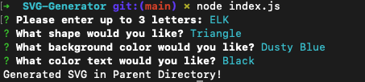
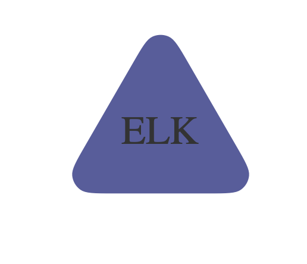

# SVG-Generator

Generate a placeholder logo quickly and easily.

## Description

Generate a barebones SVG favicon for use on your website in less than one minute.

# Table of Contents

1. [Installation](#installation)
2. [Usage](#usage)
3. [License](#license)
4. [Contributors](#contributors)
5. [Tests](#tests)
6. [Questions](#questions)

## Installation

      * Clone the repository onto your local environment.
      * Navigate to the directory in your command line. Run `npm i` to install required dependencies
      * Run `node index.js` to start the command line application. Answer the prompts and your SVG will be generated into the parent directory
      * That's it! Couldn't be easier

## Usage

Anyone who routinely finds themselves needing a placeholder logo while waiting on client deliverables will appreciate having this nifty program around.

## License

Copyright 2023 @corynko

    Permission is hereby granted, free of charge, to any person obtaining
    a copy of this software and associated documentation files (the “Software”),
    to deal in the Software without restriction, including without limitation
    the rights to use, copy, modify, merge, publish, distribute, sublicense,
    and/or sell copies of the Software, and to permit persons to whom the
    Software is furnished to do so, subject to the following conditions:

    The above copyright notice and this permission notice shall be included in
    all copies or substantial portions of the Software.

    THE SOFTWARE IS PROVIDED “AS IS”, WITHOUT WARRANTY OF ANY KIND, EXPRESS OR
    IMPLIED, INCLUDING BUT NOT LIMITED TO THE WARRANTIES OF MERCHANTABILITY,
    FITNESS FOR A PARTICULAR PURPOSE AND NONINFRINGEMENT. IN NO EVENT SHALL THE
    AUTHORS OR COPYRIGHT HOLDERS BE LIABLE FOR ANY CLAIM, DAMAGES OR OTHER
    LIABILITY, WHETHER IN AN ACTION OF CONTRACT, TORT OR OTHERWISE, ARISING FROM,
    OUT OF OR IN CONNECTION WITH THE SOFTWARE OR THE USE OR OTHER DEALINGS IN THE SOFTWARE. -- For More Information, Please Visit https://opensource.org/license/mit/

## Contributors

This project was built by @corynko. If you would like to contribute to this project, please don't hesitate to reach out.

## Tests

With your command line pointed at the install directory, run `npm run test` to establish program will work as expected. A tutorial video can be [found here.](https://u.pcloud.link/publink/show?code=XZPUPUVZz76WiTgSNXyiiKAPIGSqvQtOkgM7)

## Questions

Please don't hesitate to reach out to me at @corynko or open an issue on my repository with any questions or bugs.

- made using @corynko's readme generator -
